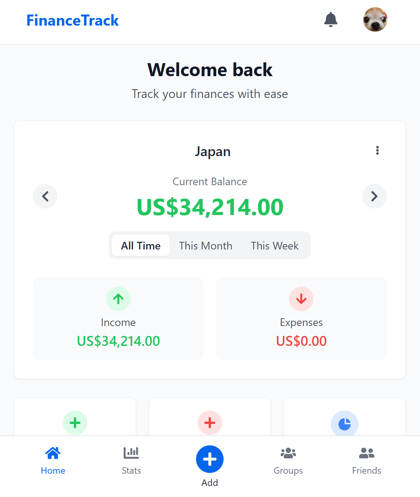
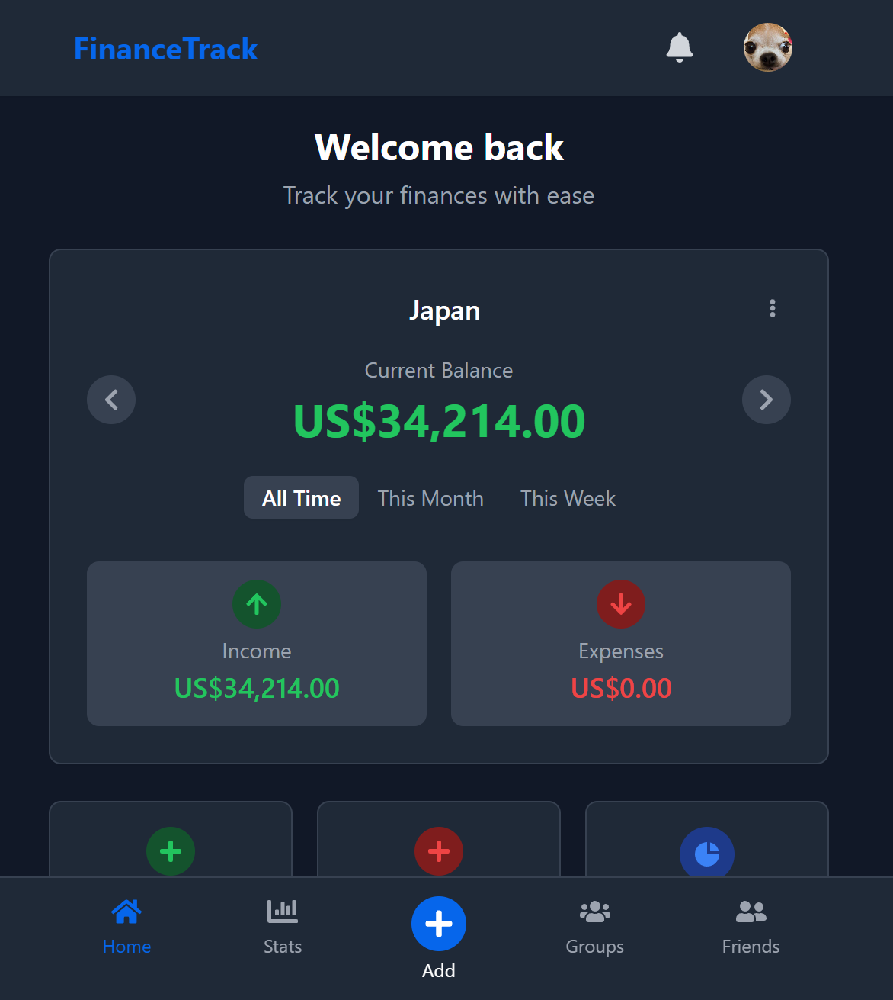

# FinanceTrack: A Personal Finance Management App

FinanceTrack is a comprehensive personal finance application designed to help users track their income, expenses, and financial goals. With features like **budget management**, **group expenses**, and **financial statistics**, FinanceTrack provides a complete solution for personal and shared financial management.

## Features
- **User Authentication**: Secure login, registration, and email verification.
- **Dark/Light Mode**: Toggle between themes for comfortable viewing.
- **Budget Management**: Create and manage multiple budgets with different currencies.
- **Transaction Tracking**: Record income and expenses with detailed categorization.
- **Financial Statistics**: Visualize your spending patterns with interactive charts.
- **Group Budgeting**: Create groups to manage shared expenses and split costs.
- **Friends System**: Connect with friends to collaborate on group budgets.
- **Data Import/Export**: Import and export transaction data in Excel format.
- **Real-time Updates**: Changes reflect instantly across devices.
- **Responsive Design**: Optimized for mobile and desktop devices.

## Technologies Used
- **Frontend**: React, React Router, TailwindCSS
- **State Management**: React Context API, useState/useEffect hooks
- **Backend**: Firebase (Authentication, Firestore, Storage)
- **Charts**: Recharts
- **Icons**: React Icons
- **Animations**: Framer Motion
- **Notifications**: React Toastify
- **Date Handling**: date-fns
- **Build Tool**: Vite

## Live Demo
Check out the live demo of FinanceTrack:  
[FinanceTrack Live Demo](http://147.93.94.250/mywisewallet/)

## Screenshots
### Light Mode

### Dark Mode


## Installation

### Prerequisites
- Node.js (v16 or higher)
- Firebase account

### Setup
1. Clone the repository:
```bash
git clone [https://github.com/<your-username>/financetrack.git](https://github.com/TheShizuka/FinanceTracker)
cd financetrack
```

2. Install dependencies:
```bash
npm install
```

3. Create a .env file in the root directory with your Firebase configuration:
```
VITE_FIREBASE_API_KEY=your-api-key
VITE_FIREBASE_AUTH_DOMAIN=your-auth-domain
VITE_FIREBASE_PROJECT_ID=your-project-id
VITE_FIREBASE_STORAGE_BUCKET=your-storage-bucket
VITE_FIREBASE_MESSAGING_SENDER_ID=your-messaging-sender-id
VITE_FIREBASE_APP_ID=your-app-id
```

4. Start the development server:
```bash
npm run dev
```

5. Open your browser and visit http://localhost:5173.

## Firebase Setup
1. Create a new Firebase project at [firebase.google.com](https://firebase.google.com)
2. Enable Authentication with Email/Password and Google providers
3. Create a Firestore database
4. Create a Storage bucket
5. Add your Firebase configuration to .env file

## Deployment
The application can be built for production using:
```bash
npm run build
```

## Contact
If you have any questions or feedback, feel free to reach out:
- Email: ayatgimenez@hotmail.com
- LinkedIn: [Hicham AYAT GIMENEZ](https://www.linkedin.com/in/hicham-a-9553ba28b/)
- Portfolio: [Portfolio Website](https://shizukadesu.com/)

Made with ❤️ by Shizuka
